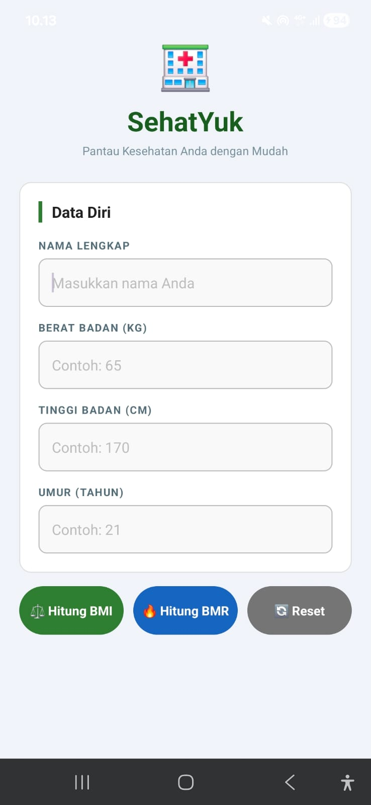
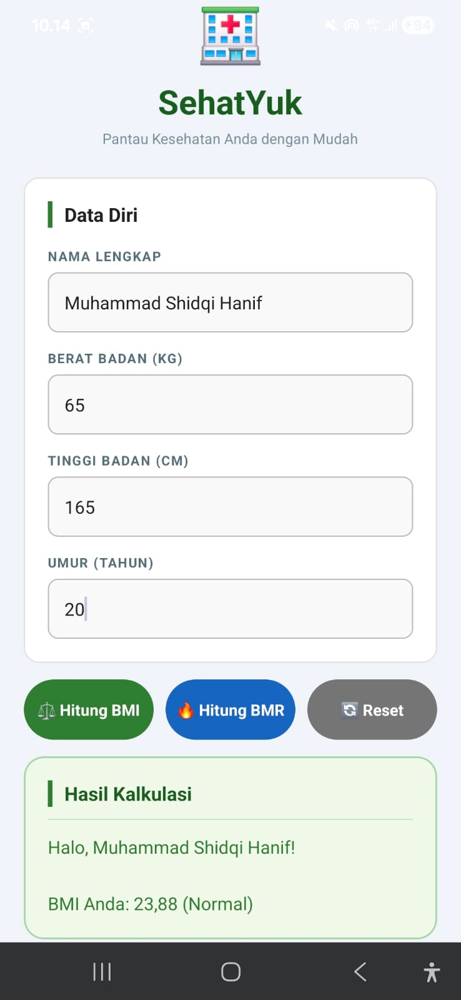
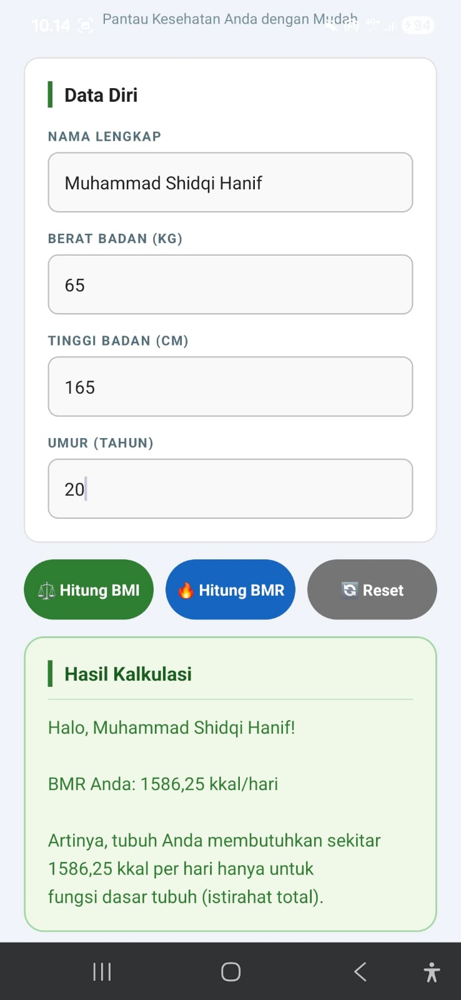
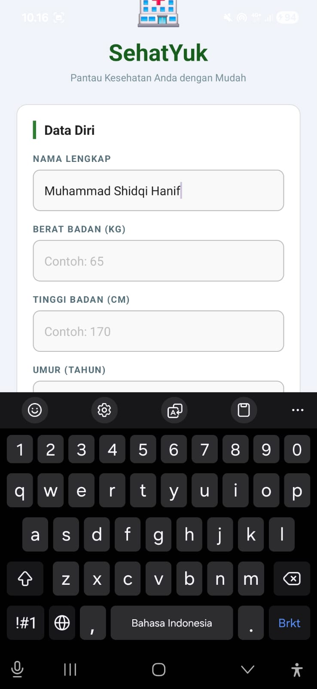
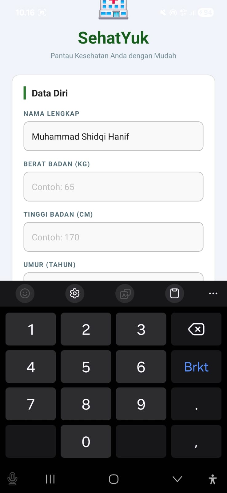
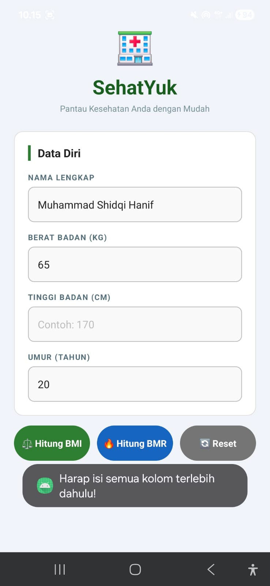
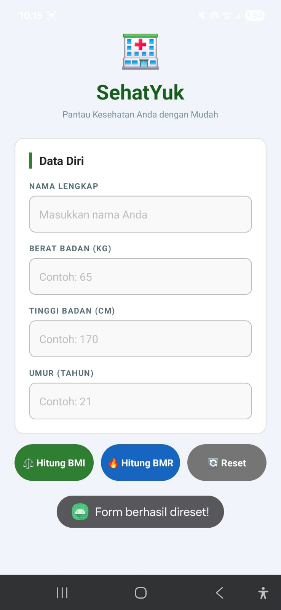

# 🏥 SehatYuk - Aplikasi Kesehatan Android

Aplikasi Android sederhana untuk memantau indikator kesehatan dasar (BMI & BMR) secara mandiri.


---

## 📋 Informasi Tugas

| | |
|---|---|
| **Mata Kuliah** | Pemrograman Berbasis Mobile |
| **Tugas** | UAS — Aplikasi Android Menggunakan Function |
| **Nama** | Muhammad Shidqi Hanif |
| **NIM** | 2408107010096 |
| **Universitas** | Universitas Syiah Kuala |

---

## 📱 Tentang Aplikasi

**SehatYuk** adalah prototipe aplikasi Android untuk klinik kesehatan digital yang membantu pengguna memantau dua indikator kesehatan dasar:

- **BMI (Body Mass Index)** — Indeks Massa Tubuh
- **BMR (Basal Metabolic Rate)** — Kebutuhan Kalori Harian Basal

---

## ✨ Fitur

- Input data diri: Nama, Berat Badan, Tinggi Badan, Umur
- Hitung BMI beserta kategori (Kurus / Normal / Kelebihan Berat Badan)
- Hitung BMR menggunakan rumus Mifflin-St Jeor
- Validasi input — mencegah crash saat field kosong
- Warna hasil dinamis sesuai kategori BMI
- Tombol Reset untuk membersihkan form
- Auto-scroll ke field aktif saat keyboard muncul

---

## 📸 Screenshot

| Home | Hasil BMI | Hasil BMR |
|:---:|:---:|:---:|
|  |  |  |

| Input Nama | Input Berat Badan | Validasi Kosong | Reset |
|:---:|:---:|:---:|:---:|
|  |  |  |  |

---

## 🏗️ Arsitektur Kode

Aplikasi menggunakan konsep **Single Activity** dengan arsitektur modular berbasis Function.

### Struktur Function Wajib

#### 1. `validateInput(): Boolean`
Memvalidasi semua field input sebelum kalkulasi diproses.
- Return `true` → semua field terisi, lanjut hitung
- Return `false` → ada field kosong, tampilkan Toast error

#### 2. `calculateBMI(weight: Double, height: Double): String`
Menghitung Body Mass Index menggunakan rumus:

```
BMI = Berat (kg) / (Tinggi (cm) / 100)²
```

| Nilai BMI | Kategori |
|---|---|
| < 18.5 | Kurus |
| 18.5 – 24.9 | Normal |
| ≥ 25 | Kelebihan Berat Badan |

#### 3. `calculateBMR(weight: Double, height: Double, age: Int): Double`
Menghitung Basal Metabolic Rate menggunakan rumus Mifflin-St Jeor:

```
BMR = (10 × Berat) + (6.25 × Tinggi) - (5 × Umur) + 5
```

---

## 🛠️ Teknologi

| Komponen | Detail |
|---|---|
| **Language** | Kotlin |
| **Min SDK** | API 24 (Android 7.0) |
| **IDE** | Android Studio |
| **Build System** | Gradle (Kotlin DSL) |
| **VCS** | Git & GitHub |

---

## 📁 Struktur Project

```
SehatYuk/
├── app/
│   └── src/main/
│       ├── java/com/sehatyuk/app/
│       │   └── MainActivity.kt
│       └── res/
│           ├── layout/
│           │   └── activity_main.xml
│           └── drawable/
│               ├── card_background.xml
│               ├── input_background.xml
│               ├── button_green.xml
│               ├── button_blue.xml
│               ├── button_reset.xml
│               ├── result_background_normal.xml
│               ├── result_background_warning.xml
│               ├── result_background_danger.xml
│               └── result_background_info.xml
├── docs/
│   ├── screenshots/
│   │   ├── home.jpeg
│   │   ├── hasil_bmi.jpeg
│   │   ├── hasil_bmr.jpeg
│   │   ├── input_nama.jpeg
│   │   ├── input_bb.jpeg
│   │   ├── test_input_kosong.jpeg
│   │   └── reset_button.jpeg
│   └── 2408107010096_MuhammadShidqiHanif_SlidePPT.pdf
├── LICENSE
└── README.md
```

---

## 🚀 Cara Menjalankan

### Prasyarat
- Android Studio (versi terbaru)
- Android SDK API 24+
- Perangkat Android / Emulator

### Langkah

**1. Clone repository**

```bash
git clone https://github.com/MuhammadShidqiHanifUSK/SehatYuk-MobileApp.git
```

**2. Buka di Android Studio**

```
File → Open → pilih folder SehatYuk-MobileApp
```

**3. Tunggu Gradle sync selesai**

**4. Jalankan ke perangkat**

```
Klik tombol ▶️ Run atau tekan Shift+F10
```

---

## 📊 Rubrik Penilaian

| No | Komponen | Bobot |
|---|---|---|
| 1 | Desain Layout UI (XML) | 20% |
| 2 | Penerapan Deklarasi Fungsi | 40% |
| 3 | Validasi & Penanganan Crash | 20% |
| 4 | Akurasi Output Matematis | 20% |

---

## 📄 Lisensi

Proyek ini dilisensikan di bawah [MIT License](LICENSE).

---

> Dibuat untuk keperluan akademik — UAS Mata Kuliah Pemrograman Berbasis Mobile
> Universitas Syiah Kuala © 2026
